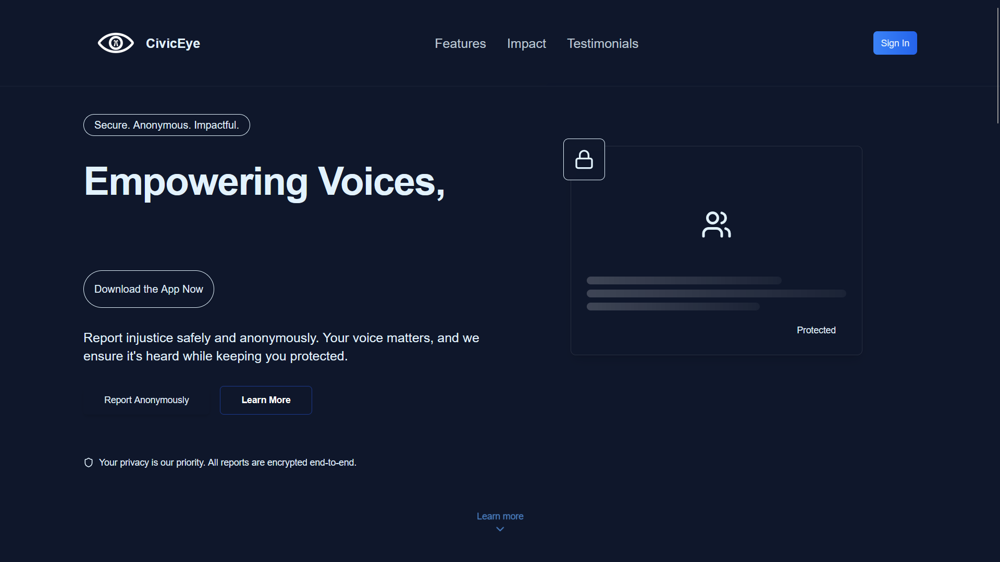

<div align="center">
  <table>
    <tr>
      <td>
        
      </td>
      <td>
        
      </td>
    </tr>
  </table>
</div>
<p align="center">
  
</p>

<p align="center">
  
</p>

A smart, secure, and anonymous platform that enables citizens to report injustice, violence, and abuse in real-time — backed by AI, blockchain integrity, and user privacy-first design.

---

## 🌟 Overview

**CivicEye** empowers individuals to safely raise their voice against abuse and wrongdoing without fear. Through AI-powered smart triggers, voice distortion, evidence protection, and real-time reporting, CivicEye ensures safety and accountability for all users.

---

## 🎯 Key Features

### Core Platform Features

- **Smart SOS Triggers**
  - Instantly activate hidden safety actions
  - Triggered by keywords, gestures, or silent interaction
  - Auto-captures location, timestamp, and hidden video/image

- **Anonymous Video/Voice Reporting**
  - Distort voices, blur faces before uploading
  - No personal information required
  - Seamless mobile integration

- **AI-Powered Categorization**
  - Automatically categorizes reports into abuse types
  - Detects critical tone and urgency using NLP

- **Blockchain-Powered Integrity**
  - Immutable log of evidence
  - Timestamp verification
  - Ensures data is not tampered with after submission

- **Report Tracking**
  - Anonymous status updates via report ID
  - NGOs and Moderators can provide resolution updates

- **NGO/Moderator Panel**
  - Verified NGOs get access to real-time reports
  - Filter based on type/location/urgency
  - Track reports, update progress, offer help

---

## 🔧 Technology Stack

### 🧠 AI & Vision
- **OpenCV** – for face detection and blurring

### 📦 Backend
- **FastAPI** – lightweight and high-performance REST API
- **Supabase** – Postgres-based backend as a service (auth, database, storage)
- **Blockchain APIs** – for timestamping and integrity proofs

### 💻 Frontend
- **Next.js** – SSR web interface
- **Tailwind CSS** – for UI styling
- **Shadcn/ui** – UI components
- **TypeScript** – type-safe development

### 📱 Mobile App
- **Flutter** – cross-platform reporting app
- Secure media capture & upload
- Background SOS triggers

---

## 🔄 Workflow

### 1. **User Flow**
- Launch web/mobile app anonymously
- Trigger SOS or submit incident
- Upload video/image/audio
- Receive anonymous tracking ID

### 2. **Moderator Flow**
- Access encrypted report stream
- Use AI to prioritize
- Provide updates, add response notes

### 3. **NGO Panel**
- Request verification
- Access filtered, location-specific reports
- Offer help and follow up

---

## 🎯 SDG Goals Alignment

### SDG 16 – Peace, Justice & Strong Institutions
- Enables secure civic engagement
- Builds trust in response systems
- Protects vulnerable populations

### SDG 5 – Gender Equality
- Confidential platform for victims
- Reduces reporting hesitation
- Strengthens support mechanisms

---

## 🚀 Getting Started

### Prerequisites
```bash
Python >= 3.10
Node.js >= 18.0.0
Flutter >= 3.0.0
Supabase Project (configured)
```

### Installation
1. Clone the repository
```bash
git clone https://github.com/Vaibhav2154/civic-eye.git
cd civic-eye
```

2. Install dependencies
```bash
npm install
```

3. Set up environment variables
```bash
cp .env.example .env
# Edit .env with your configuration
```

4. Start the development server
```bash
npm run dev
```